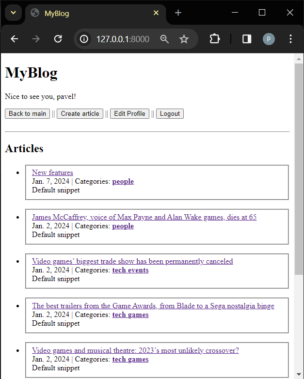

# Django-Blog-project

This is a blog application made on django.

### Status
- In progress, code is not cleaned and more features will be implemented in future as well as the frontend side of this project.
- Articles were copied form "The Guardian" all rights for the contend belongs to "The Guardian".

## Features

- User autentification: secure user accounts with a registration and login system. 
- Commenting System: user can leave a comment on any article using his username (login required)
- Like and Unlike buttons: user can like on articles and then unlike it (login required)
- Creating articles + advenced text editor. Option to edit or delete your articles
- Editing you profile (username, first and last names, email)
- User friendly design

## Screenshots

|                         | Screenshot                                          |
|-------------------------|-----------------------------------------------------|
| Login Page              |    |
| Register Page           |  |
| Main Page               |      |
| Article Page            |  |
| Create article          |  |

---

  Thank you for visiting.

