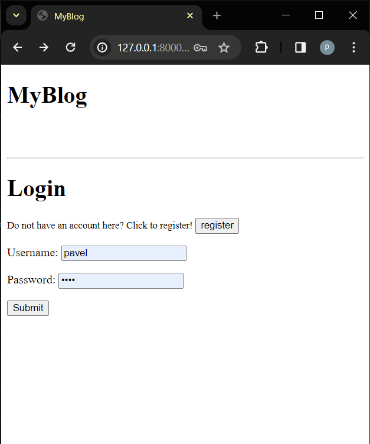

# Django-Blog-project

This is a blog application made on django.

### Status
- In progress, code is not cleaned and more fetures will be implemented in future.
- Articles were copied form "The Guardian" all rights for the contend belongs to "The Guardian".

## Features

- User autentification: secure user accounts with a registration and login system. 
- Commenting System: user can leave a comment on any article using his username (login required)
- Like and Unlike buttons: user can like on articles and then unlike it (login required)
- User friendly design

## Screenshots

* Login Page
  

* Register Page
  

* Main Page
  

* Article Page
  

---

  Thank you for visiting.

